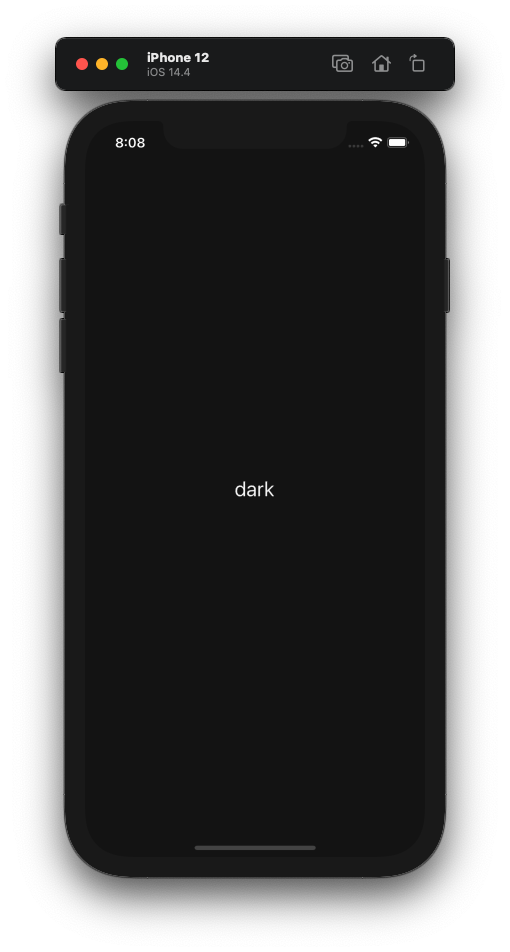
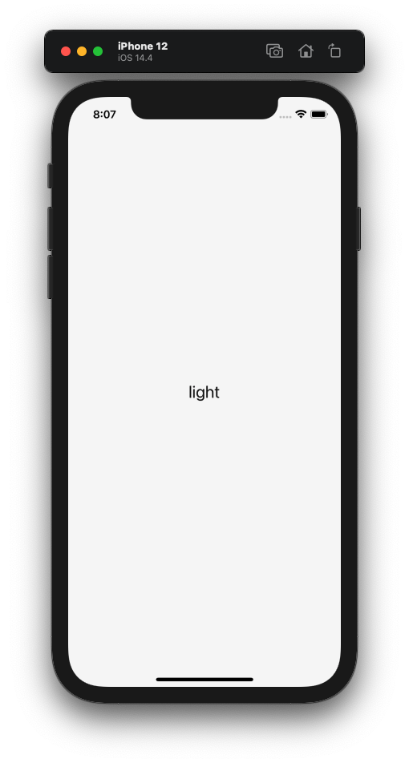

# react-native-color-scheme

Este projeto é para apresentar como utilizar as preferências do sistema do celular do usuário para apresentar as cores baseadas nesse tema.

<div>


</div>

## Como foi construído?

O hook **useColorScheme()** é um hook que disponibiliza a aparência utilizada pelo usuário.

https://reactnative.dev/docs/usecolorscheme

## 👨‍💻️ Tecnologias Utilizadas

Esse projeto foi construído utilizando as seguintes tecnologias:
  
### Mobile

  - [React Native](https://reactnative.dev/)
  
### Dependencies

  - [TypeScript](https://www.typescriptlang.org/)
  - [Styled-Components](https://styled-components.com/)
  
### IDE

  - [Visual Studio Code](https://code.visualstudio.com/)

---
 
## 📦️ Como Clonar e Rodar o Projeto

> [Node.js](https://nodejs.org/en/) and [Yarn](https://yarnpkg.com/) or [NPM](https://www.npmjs.com/) are required

Para clonar o projeto, utilize os comandos:

```bash
  # Clonar o repositório
  ❯ git clone https://github.com/hstrada/react-native-color-scheme.git

  # Acessar o repositório
  ❯ cd react-native-color-scheme
```

### Mobile

**IOS**

```bash
  # Entre na pasta do diretório
  > cd Colourse

  # Instale as dependências
  ❯ yarn

  # Instale as referências do iOS
  ❯ npx pod-install
  
  # Inicie o projeto
  ❯ yarn ios
```

**Android**

```bash
  # Entre na pasta do diretório
  > cd Colourse

  # Instale as dependências
  ❯ yarn
  
  # Inicie o projeto
  ❯ yarn android
```
---
 
